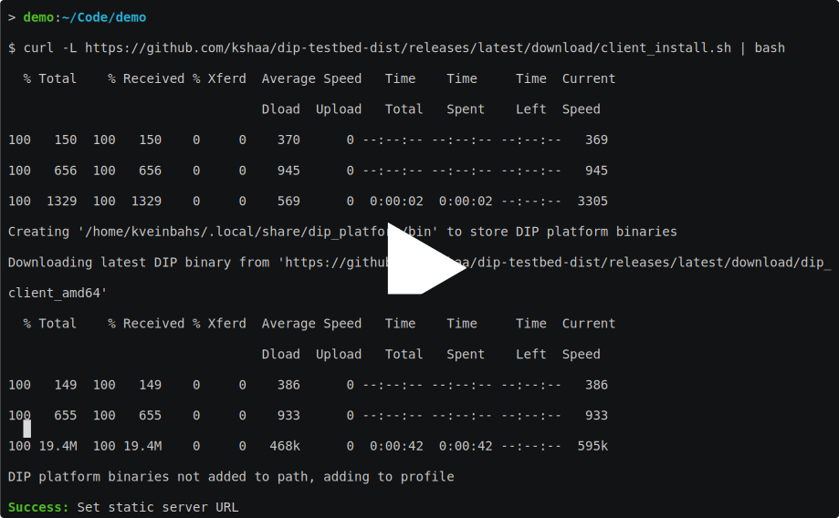
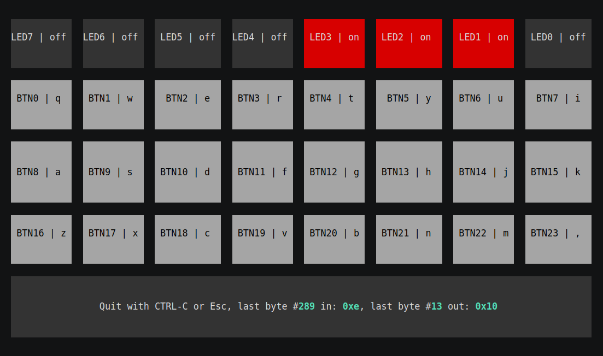

# DIP Testbed
  
DIP Testbed Platform is an academic work which allows users to remotely program and experience physical, embedded devices through various virtual interfaces (uni-directional webcam stream, bi-directional serial connection stream).  
  
_N.B. This is an academic piece of work, it's rough around the edges, because time was a significant constraint._  

## Demo
### Installation
[](https://asciinema.org/a/1qW4VymT8G2blxtuMJqJcMboe)  

### Usage
[](https://asciinema.org/a/LKwWorWIw3TfYmJH7qKeG6ywP)  
  
## Quick installation & usage
Download the CLI tool:
```bash
curl -L https://github.com/kshaa/dip-testbed-dist/releases/latest/download/client_install.sh | bash
```
  
Create a local authentication session:
```bash
dip_client session-auth -u <username> -p <password>
```
  
Upload software to the platform, forward it to a hardware board, start a web video stream in a browser, run a serial connection against the board: 
```bash
dip_client quick-run -f firmware.bit -b ${BOARD_UUID}
```

_Note: This assumes usage of bash, AMD64 architecture, testbed.veinbahs.lv as default server_  
_Note: Also the default buttonled interface is used_  
_Note: Quick run has all of the underlying mechanics configurable, see options with `quick-run --help`_  
  
## Detailed platform usage

### Installation
- Download `https://github.com/kshaa/dip-testbed-dist/releases/latest/download/dip_client_${TARGET_ARCH}`  
- Store in `${PATH}`
- Set executable bit

### Platform access initiation
  
Configure academic DIP Testbed platform server:
```bash
dip_client session-static-server -s http://testbed.veinbahs.lv
dip_client session-control-server -s ws://testbed.veinbahs.lv
```
  
Authenticate:  
```bash
dip_client session-auth -u <username> -p <password>
```
  
### Developer usage

Upload software to platform:
```bash
dip_client software-upload -f firmware.bit
```

Forward software to a hardware board:
```bash
dip_client hardware-software-upload --hardware-id ${BOARD_UUID} --software-id ${SOFTWARE_UUID}
```

Create a serial connection to the board:
```
dip_client hardware-serial-monitor --hardware-id ${BOARD_UUID} -t buttonleds
```

### Lab operator usage
  
Register hardware in platform:
```
dip_client hardware-create --name ${BOARD_NAME}
```
  
Run agent for registered hardware (allows remote access & management by platform):
```
dip_client agent-${AGENT_TYPE} -b ${BOARD_UUID} <AGENT_SPECIFIC_OPTIONS>
```
  
_Note: For agent-specific usage, see `dip_client agent-${AGENT_TYPE} --help`_  
  
## Documentation
- See 🌼 🌻 [docs](./docs/README.md) 🌻 🌼 for user-centric documentation  
- See [prototypes](./prototypes/README.md) for examples of the testbed platform usage  
  
## Development
The following links are currently available only by special request  
  
- See [backend](./backend/README.md) for backend implementation & usage  
- See [client](./client/README.md) for client and agent implementation & usage  
- See [database](./database/README.md) for database usage  
  
## Fun statistics
```bash
$ # Timestamp: 2022-03-13-00-17-25
$ git clean -fxd
[...]
$ rm -rf ./backend/web/public # Not my code
[...]
$ docker run -v $PWD:/data mribeiro/cloc .
     286 text files.
     277 unique files.                                          
    3794 files ignored.

http://cloc.sourceforge.net v 1.60  T=1.12 s (197.9 files/s, 12522.3 lines/s)
-----------------------------------------------------------------------------------
Language                         files          blank        comment           code
-----------------------------------------------------------------------------------
Python                              90           1331            681           6047
Scala                               89            477            107           3007
Verilog-SystemVerilog               15            221            245           1053
Bourne Shell                        18             96             92            398
HTML                                 5              8              0             84
SQL                                  1             17             14             43
XML                                  1             13              7             39
YAML                                 2              0              1             33
C++                                  1              4             14             14
-----------------------------------------------------------------------------------
SUM:                               222           2167           1161          10718
-----------------------------------------------------------------------------------
```
