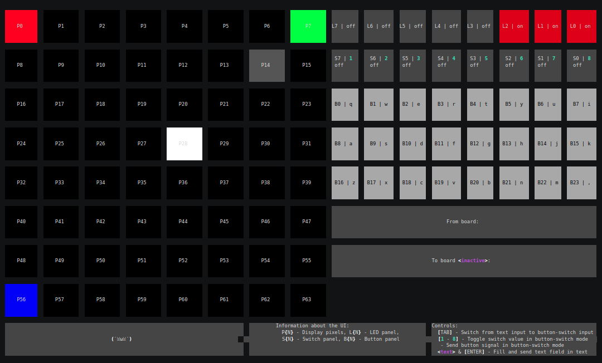

# DIP Testbed
  
DIP Testbed Platform is an academic work which allows users to remotely program and experience physical, embedded devices through various virtual interfaces (uni-directional webcam stream, bi-directional serial connection stream).  
  
_N.B. This is an academic piece of work, it's rough around the edges, because time was a significant constraint._  
_N.B. It is not production grade in any way. It works, but it's an experiment, a prototype._  
  
## Demo
### Installation
This asciicast shows how to install and configure the `dip_client` CLI tool.  
  
[](https://asciinema.org/a/1qW4VymT8G2blxtuMJqJcMboe)  

### Usage (Button & LED interface)
This asciicast shows how to run Verilog on a board and interact with it using a virtual button & LED interface.  
Verilog in question: [`./prototypes/03-anvyl-uart-remote/main.v`](./prototypes/03-anvyl-uart-remote/main.v)  
  
[](https://asciinema.org/a/LKwWorWIw3TfYmJH7qKeG6ywP)  
  
### Usage (MinOS interface)
This asciicast shows how to run Verilog on a board and interact with it using a virtual MinOS interface.  
Verilog in question: [`./prototypes/06-anvyl-min-os/main.v`](./prototypes/06-anvyl-min-os/main.v)  
  
[](https://asciinema.org/a/UHuU1Ur8e0CgoTmsm5khLuOJH)  
  
A high-level, technical description of what this demo contains is as follows:  
- `dip_client quick-run` uploads compiled Verilog firmware `anvyl-min-os/main.v` to the DIP platform
- `dip_client quick-run` "forwards" the firmware i.e. the `backend` from the platform to the Anvyl FPGA board
- _A network-attached Raspberry Pi running `dip_client agent-anvyl` receives this firmware upload request_
- _That same `dip_client agent-anvyl` downloads the firmware from the platform and uploads it into the board and responds successfully_
- `dip_client quick-run` receives a successful upload response & initiates a serial monitor connection
- _That same `dip_client agent-anvyl` initiates a serial connection to the board and starts streaming between the board and the platform_  
- `dip_client quick-run` starts a "MinOS" virtual user interface i.e. the `frontend` for interacting over the remote serial connection  
- In this demo the `frontend` and `backend` only exchange _streamed_ binary packets
- The content syntax for the binary packets (`chunks`) has been described using the BNF notation in [`prototypes/06-anvyl-min-os/syntax.bnf`](prototypes/06-anvyl-min-os/syntax.bnf)  
- The different types of chunks are implemented, encoded & decoded seperately both in `frontend` and `backend`, they are:
  - `LedChunk(type = 2)` - Contains latest LED contents i.e. 8 bits which are sent from BE to FE  
  - `IndexedButtonChunk(type = 3)` - Contains an index for a button in a range from 0 to 2^8  
  - `SwitchChunk(type = 4)` - Contains latest switch contents i.e. 8 bits which are sent from FE to BE  
  - `TextChunk(type = 5)` - Contains 32 bytes of regular UTF-8 encoded text which can be sent back and forth between FE and BE  
  - `DisplayChunk(type = 6)` - Contains a display pixel change at a 0-based index N in a range from 0-63 and with a value in a range from 0 to (2^2)^3  
  
A slightly more business-level description is as follows:
- Custom Verilog which uses a "MinOS" serial abstraction is uploaded to the board  
- A "MinOS" virtual interface is spawned in the CLI  
- The user sees blinking RGB lights in the corners of the virtual display  
- The user can move two pixels around using virtual buttons  
- The user can flip 8 virtual switches on and off  
- Virtual LEDs show a counter when all virtual switches are off  
- If any virtual switch is on then the virtual LEDs mirror the state of the virtual switches  

## Quick installation & usage
Download the CLI tool:
```bash
curl -L https://github.com/kshaa/dip-testbed-dist/releases/latest/download/client_install.sh | bash
```
  
Create a local authentication session:
```bash
dip_client session-auth -u <username> -p <password>
```
  
Upload software to the platform, forward it to a hardware board, start a web video stream in a browser, run a serial connection against the board: 
```bash
dip_client quick-run -f firmware.bit -b ${BOARD_UUID}
```

_Note: This assumes usage of bash, AMD64 architecture, testbed.veinbahs.lv as default server_  
_Note: Also the default buttonled interface is used_  
_Note: Quick run has all of the underlying mechanics configurable, see options with `quick-run --help`_  
  
## Detailed platform usage

### Installation
- Download `https://github.com/kshaa/dip-testbed-dist/releases/latest/download/dip_client_${TARGET_ARCH}`  
- Store in `${PATH}`
- Set executable bit

### Platform access initiation
  
Configure academic DIP Testbed platform server:
```bash
dip_client session-static-server -s http://testbed.veinbahs.lv
dip_client session-control-server -s ws://testbed.veinbahs.lv
```
  
Authenticate:  
```bash
dip_client session-auth -u <username> -p <password>
```
  
### Developer usage

Upload software to platform:
```bash
dip_client software-upload -f firmware.bit
```

Forward software to a hardware board:
```bash
dip_client hardware-software-upload --hardware-id ${BOARD_UUID} --software-id ${SOFTWARE_UUID}
```

Create a serial connection to the board:
```
dip_client hardware-serial-monitor --hardware-id ${BOARD_UUID} -t buttonleds
```

### Lab operator usage
  
Register hardware in platform:
```
dip_client hardware-create --name ${BOARD_NAME}
```
  
Run agent for registered hardware (allows remote access & management by platform):
```
dip_client agent-${AGENT_TYPE} -b ${BOARD_UUID} <AGENT_SPECIFIC_OPTIONS>
```
  
_Note: For agent-specific usage, see `dip_client agent-${AGENT_TYPE} --help`_  
  
## Documentation
- See 🌼 🌻 [docs](./docs/README.md) 🌻 🌼 for user-centric documentation  
- See [prototypes](./prototypes/README.md) for examples of the testbed platform usage  
  
## Development
The following links are currently available only by special request  
  
- See [backend](./backend/README.md) for backend implementation & usage  
- See [client](./client/README.md) for client and agent implementation & usage  
- See [database](./database/README.md) for database usage  
  
## Fun statistics
```bash
$ # Timestamp: 2022-03-13-00-17-25
$ git clean -fxd
[...]
$ rm -rf ./backend/web/public # Not my code
[...]
$ docker run -v $PWD:/data mribeiro/cloc .
     286 text files.
     277 unique files.                                          
    3794 files ignored.

http://cloc.sourceforge.net v 1.60  T=1.12 s (197.9 files/s, 12522.3 lines/s)
-----------------------------------------------------------------------------------
Language                         files          blank        comment           code
-----------------------------------------------------------------------------------
Python                              90           1331            681           6047
Scala                               89            477            107           3007
Verilog-SystemVerilog               15            221            245           1053
Bourne Shell                        18             96             92            398
HTML                                 5              8              0             84
SQL                                  1             17             14             43
XML                                  1             13              7             39
YAML                                 2              0              1             33
C++                                  1              4             14             14
-----------------------------------------------------------------------------------
SUM:                               222           2167           1161          10718
-----------------------------------------------------------------------------------
```
