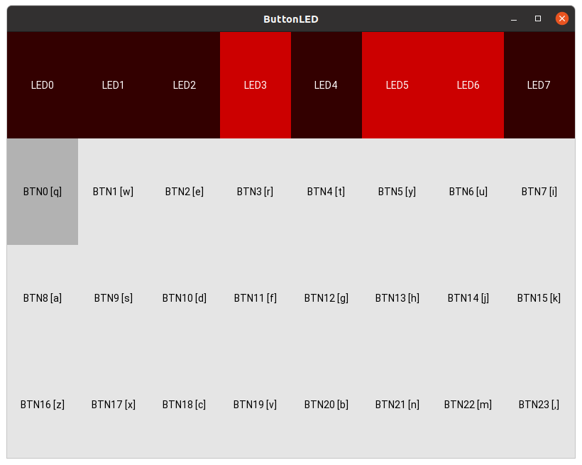

# Client usage
  
1) Download CLI client:  
```bash
curl https://github.com/kshaa/dip-testbed-dist/releases/download/<version>/dip_client_<arch> -L -o dip_client
```
_Note: Replace `<version>` with a release verion e.g. `v3.0.2` and `<arch>` with a CPU architecture e.g. `x86_64`_  
  
2) Make this binary executable: [read a how-to article](https://lmgtfy.app/?q=linux+make+binary+executable)  
3) Configure this binary in your PATH permanently: [read a how-to article](https://lmgtfy.app/?q=ubuntu+add+binary+to+path+permanently)  
4) `dip_client --help` - Read thorough help instructions  
5) `dip_client <subcommand> --help` - Read thorough help instructions for a subcommand  
  
_Note: Before sending me e-mails, please read the help documentations_  

## Recommendations
- The client accepts a lot of parameters/options as environment variables
- So you can call `dip_client list-users -s http://<server>`
- And you can call `DIP_CLIENT_STATIC_SERVER="http://<server>" dip_client list-users`
- And you can also do the following:
    1) Create an environment file `env.sh`
    ```bash
    #!/usr/bin/env bash
    export DIP_CLIENT_STATIC_SERVER="http://<server>"
    export DIP_CLIENT_CONTROL_SERVER="ws://<server>"

    # .. later add more environment variables if needed
    # .. for example you could add authentication as follows
    # export DIP_USER_USERNAME="<username>" 
    # export DIP_USER_PASSWORD="<password>" 
    ```
    2) Source the environment variables into your shell using `source ./env.sh`  
    3) Call the CLI client without the fluff: `dip_client list-users`  

## Example: Creating a user
```bash
$ source ./env.sh # Load static server URL into environment
$ ./dip_client user-create -u kshaa -p <password>
                     User list                     
┏━━━━━━━━━━━━━━━━━━━━━━━━━━━━━━━━━━━━━━┳━━━━━━━━━━┓
┃ Id                                   ┃ Username ┃
┡━━━━━━━━━━━━━━━━━━━━━━━━━━━━━━━━━━━━━━╇━━━━━━━━━━┩
│ 84633ccd-d089-4127-8a9c-b10cb21eef9c │ kshaa    │
└──────────────────────────────────────┴──────────┘
```

## Example: Setting up an Anvyl upload agent
First register the hardware in the Testbed  
```bash
$ echo 'export DIP_USER_USERNAME="<username>"' > ./env.sh
$ echo 'export DIP_USER_PASSWORD="<password>"' > ./env.sh
$ source ./env.sh # Load static server and auth into environment
$ dip_client hardware-create -n kshaa-anvyl-01
                                         Hardware list                                          
┏━━━━━━━━━━━━━━━━━━━━━━━━━━━━━━━━━━━━━━┳━━━━━━━━━━━━━━━━┳━━━━━━━━━━━━━━━━━━━━━━━━━━━━━━━━━━━━━━┓
┃ Id                                   ┃ Name           ┃ Owner id                             ┃
┡━━━━━━━━━━━━━━━━━━━━━━━━━━━━━━━━━━━━━━╇━━━━━━━━━━━━━━━━╇━━━━━━━━━━━━━━━━━━━━━━━━━━━━━━━━━━━━━━┩
│ adc0d413-468d-4719-b202-79dacc47ba2d │ kshaa-anvyl-01 │ 84633ccd-d089-4127-8a9c-b10cb21eef9c │
└──────────────────────────────────────┴────────────────┴──────────────────────────────────────┘
```

Then initiate the agent
```bash
$ source ./env.sh # Load static server and auth into environment
$ dip_client agent-anvyl-upload -i adc0d413-468d-4719-b202-79dacc47ba2d -d Anvyl -s 0
[2021-10-22 17:51:47] [INFO] [entrypoint] Running async client
[2021-10-22 17:51:47] [INFO] [client] Connected to control server, listening for commands, running start hook
```

_Note: This agent will fail if the server connection drops, if you want to set up a permanent agent
you should create a wrapper script which will re-start this agent script. This could also be created as
a systemd service for example. Alternatively I could add an option for retrying connections with backoff,
but that's not currently implemented._  
  
_Note: Only one agent can be spawned for a given hardware id._  
  
## Example: Uploading software to an Anvyl agent
First you need to upload a program file  
```bash
$ source ./env.sh # Load static server and auth into environment
$ dip_client software-upload -f $HOME/Code/dip/MD_ADD/main.bit -n kshaa_md_add.bit
                                          Software list                                           
┏━━━━━━━━━━━━━━━━━━━━━━━━━━━━━━━━━━━━━━┳━━━━━━━━━━━━━━━━━━┳━━━━━━━━━━━━━━━━━━━━━━━━━━━━━━━━━━━━━━┓
┃ Id                                   ┃ Name             ┃ Owner id                             ┃
┡━━━━━━━━━━━━━━━━━━━━━━━━━━━━━━━━━━━━━━╇━━━━━━━━━━━━━━━━━━╇━━━━━━━━━━━━━━━━━━━━━━━━━━━━━━━━━━━━━━┩
│ b4e1cedf-c118-4517-bfbe-68ae754593fb │ kshaa_md_add.bit │ 84633ccd-d089-4127-8a9c-b10cb21eef9c │
└──────────────────────────────────────┴──────────────────┴──────────────────────────────────────┘
```

Then you can upload that software to a given hardware  
```bash
$ source ./env.sh # Load static server and auth into environment
$ dip_client hardware-software-upload --hardware-id adc0d413-468d-4719-b202-79dacc47ba2d --software-id b4e1cedf-c118-4517-bfbe-68ae754593fb
Success: Uploaded software to hardware!
```

Also you can abuse this service and upload complete gibberish  
```bash
$ source ./env.sh # Load static server and auth into environment
$ ./dip_client software-upload -f ../notes/potato.txt -n potato.txt
                                       Software list                                        
┏━━━━━━━━━━━━━━━━━━━━━━━━━━━━━━━━━━━━━━┳━━━━━━━━━━━━┳━━━━━━━━━━━━━━━━━━━━━━━━━━━━━━━━━━━━━━┓
┃ Id                                   ┃ Name       ┃ Owner id                             ┃
┡━━━━━━━━━━━━━━━━━━━━━━━━━━━━━━━━━━━━━━╇━━━━━━━━━━━━╇━━━━━━━━━━━━━━━━━━━━━━━━━━━━━━━━━━━━━━┩
│ f57bb995-4f2f-40b1-a4f9-1baa2d2141ca │ potato.txt │ 84633ccd-d089-4127-8a9c-b10cb21eef9c │
└──────────────────────────────────────┴────────────┴──────────────────────────────────────┘
$ dip_client software-download -i f57bb995-4f2f-40b1-a4f9-1baa2d2141ca -f potato.txt
Success: Downloaded software: potato.txt
$ cat potato.txt 
potato
potato
potato
$ dip_client hardware-software-upload --hardware-id adc0d413-468d-4719-b202-79dacc47ba2d --software-id f57bb995-4f2f-40b1-a4f9-1baa2d2141ca
Error: Failed to upload software to hardware:
#### Status code: 1
#### Stdout:
Initializing scan chain...
Found Device ID: 44008093

Found 1 device(s):
    Device 0: XC6SLX45
Uploading '/tmp/tmpkzch7eow.bit'
Upload failed, was the firmware a valid program?

#### Stderr:
/tmp/_MEIKYAIie/static/digilent_anvyl/upload.sh: line 84: 644782 Segmentation fault      (core dumped) djtgcfg prog -d "${device}" -i ${scanchainindex} -f "${firmwarehextmp}"
```

## Example: Monitor hardware serial port remotely
_Pre-requisites: Download this repo, specifically [examples/anvyl-uart-remote/](./examples/anvyl-uart-remote/)_  
_Pre-requisites: Compile [examples/anvyl-uart-remote/](./examples/anvyl-uart-remote/) in Xilinx ISE thereby creating `main.bit`_  

Hardware monitoring is actively in-development, currently there are two possible implementations.

### Monitoring types
```bash
$ ./dist/dip_client hardware-serial-monitor --help
[...]
  -t, --monitor-type [hexbytes|buttonleds|script]
                                  Sets the type of monitor implementation to
                                  be used  [env var: DIP_MONITOR_TYPE;
                                  required]
  -s, --monitor-script-path TEXT  File path to the monitor implementation
                                  script e.g. './monitor-script.py'  [env var:
                                  DIP_MONITOR_SCRIPT_PATH]
[...]
```
  
As you can see the possible monitoring types are `hexbytes` and `script`.  
- `hexbytes` - Monitor port payload as a hex byte stream  
- `buttonleds` - Interact with serial data as a graphical button & LED interface  
- `script` - Use custom Python script for managing monitoring socket rx, tx & interfacing  

### Monitor serial port as hex byte stream (`hexbytes`)
```bash
$ source ./env.sh # Load static server and auth into environment
$ # First upload the compiled example project
$ ./dip_client software-upload -n anvyl-uart-remote.bit -f examples/anvyl-uart-remote/main.bit
                                             Software list                                             
┏━━━━━━━━━━━━━━━━━━━━━━━━━━━━━━━━━━━━━━┳━━━━━━━━━━━━━━━━━━━━━━━┳━━━━━━━━━━━━━━━━━━━━━━━━━━━━━━━━━━━━━━┓
┃ Id                                   ┃ Name                  ┃ Owner id                             ┃
┡━━━━━━━━━━━━━━━━━━━━━━━━━━━━━━━━━━━━━━╇━━━━━━━━━━━━━━━━━━━━━━━╇━━━━━━━━━━━━━━━━━━━━━━━━━━━━━━━━━━━━━━┩
│ 95b575a3-a8c8-4962-9abf-ffe96e1ad264 │ anvyl-uart-remote.bit │ 84633ccd-d089-4127-8a9c-b10cb21eef9c │
└──────────────────────────────────────┴───────────────────────┴──────────────────────────────────────┘
$ # Then upload that software onto the hardware (supposing that the hardware is online)
$ ./dip_client hardware-software-upload --hardware-id adc0d413-468d-4719-b202-79dacc47ba2d --software-id 95b575a3-a8c8-4962-9abf-ffe96e1ad264
Success: Uploaded software to hardware!
$ # Then monitor the hardware serial port remotely
$ ./dip_client hardware-serial-monitor -i adc0d413-468d-4719-b202-79dacc47ba2d
666666bbbbbcccccdddddee
Success: Finished monitoring hardware!
```

_Note: For exiting the serial monitor use Ctrl-C._  
_Note: For more info on the Anvyl UART remote program and the architecture of this Testbed, read [examples/anvyl-uart-remote/README.md](./examples/anvyl-uart-remote/README.md)._    


### Monitor serial port using custom Python script (`buttonleds`)
```bash
$ ./dist/dip_client hardware-serial-monitor --hardware-id 44a2e91b-00aa-41f6-91b1-3d7b18f5f5fa -t buttonleds
[INFO   ] [Logger      ] Record log in $REDACTED_HOME/.kivy/logs/kivy_22-01-09_22.txt
[INFO   ] [Kivy        ] v2.0.0
[INFO   ] [Kivy        ] Installed at "/tmp/_MEIznRFvk/kivy/__init__.pyc"
[INFO   ] [Python      ] v3.9.7 (default, Jan  7 2022, 13:30:11) 
[...]
```
  
The graphical interface looks as follows:  
  

Each button is simply sent as a byte, e.g. `BTN1` is `0x01` i.e. `0b00000001`.  
Each received byte resets the LEDs, e.g. `0b01000001` means `LED1` and `LED7` are on.  

### Monitor serial port using custom Python script (`script`)
See [./examples/monitor_serial_hexbytes/README.md](./examples/monitor_serial_hexbytes/README.md) for more info.  

The custom script can be executed as follows:  
```bash
$ ./dip_client hardware-serial-monitor -i adc0d413-468d-4719-b202-79dacc47ba2d -t script -s ./examples/monitor_serial_hexbytes/monitor.py
```

## Extras
Most requests are capable of also printing out JSON instead of tables:
```bash
$ source ./env.sh # Load static server and auth into environment
$ ./dip_client software-list -j true # Option no. 1
$ DIP_CLIENT_JSON_OUTPUT=true ./dip_client software-list # Option no. 2
[
  {
    "id": "b4e1cedf-c118-4517-bfbe-68ae754593fb",
    "name": "kshaa_md_add.bit",
    "owner_uuid": "84633ccd-d089-4127-8a9c-b10cb21eef9c"
  },
  {
    "id": "f57bb995-4f2f-40b1-a4f9-1baa2d2141ca",
    "name": "potato.txt",
    "owner_uuid": "84633ccd-d089-4127-8a9c-b10cb21eef9c"
  }
]

```
